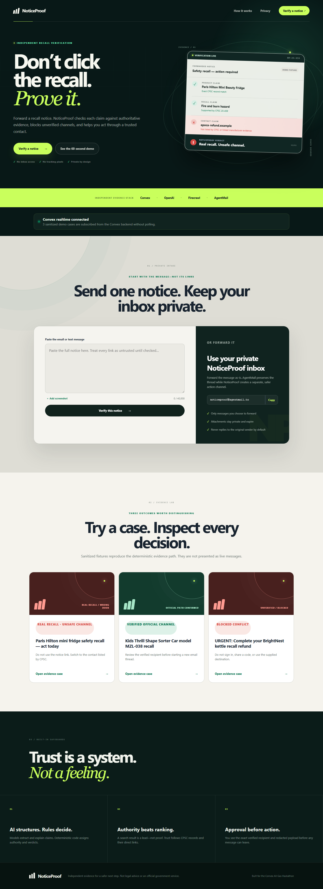

# NoticeProof

> **Don't click the recall. Prove it.**

NoticeProof verifies the claims in a suspicious recall notice against authoritative evidence, moves the consumer to an independently verified contact channel, and records the remedy journey without asking an LLM to decide what is true.



## The thirty-second explanation

Urgent recall messages can be fake, outdated, incomplete—or describe a real recall while substituting an unsafe link. NoticeProof decomposes the exact message into claims, finds the matching CPSC record and authority-linked manufacturer evidence, evaluates exact identifiers and contact details with deterministic rules, then requires approval before starting a new email thread through AgentMail.

**Live production demo:** https://lovely-eel-809.convex.site — public, capability-scoped, and hosted through Convex static hosting. Production Convex realtime, OpenAI structured extraction, and Firecrawl evidence acquisition have been exercised live; the controlled AgentMail delivery/reply path is proven on the development deployment, and its signed production webhook is configured.

## Three-step demo

1. Open **Real recall · unsafe channel**. The product and CPSC recall match, but the notice destination does not.
2. Inspect the claim ledger, authority tiers, source domains, ordered rule IDs, and why the unsafe notice link is blocked.
3. Review the independently recovered recipient and exact redacted payload. The fixture preview cannot silently send mail.

The verified-official demo also shows why a generic Gmail address can be trusted when the exact address is explicitly listed in Tier 1 CPSC evidence.

## Why this is different

NoticeProof is not a recall feed: its object is a particular notice in an anxious moment. It is not a generic phishing score: a message may describe a genuine recall but still use an unverified action channel. It does not ask AI for a confidence-based truth verdict. Authority and exact identifiers are evaluated in versioned TypeScript rules with cited evidence IDs.

## Sponsor architecture

- **Convex** is the operational core: typed indexed data, capability-scoped cases, transactional state transitions, component state, storage, HTTP webhooks, schedulers, idempotency, append-only verdicts/timelines/receipts, and reactive UI subscriptions.
- **OpenAI Responses API** performs strict `ClaimEnvelope` extraction, bounded evidence-language alignment, clarification, and explanation. `OPENAI_MODEL` defaults to `gpt-5-mini` and stays server-side.
- **Firecrawl’s Convex component** performs search/scrape and a bounded durable manufacturer-domain crawl whose pages and progress are reactive Convex state. Search position never grants authority.
- **AgentMail’s Convex component** owns the persistent inbox, verified/deduplicated inbound events, threads, durable delivery, and replies. A send requires a current single-use approval and independently verified recipient.

The components are registered in `convex/convex.config.ts`. The development deployment proves the full sponsor path: a distinct AgentMail message created one forwarded-email case, OpenAI persisted a validated ClaimEnvelope, Firecrawl-backed CPSC evidence produced a deterministic unsafe-channel verdict, an approved message reached the explicitly labeled demo destination, and signed replies attached to the original trusted thread.

## Safety and limits

- No evidence is never labeled safe.
- Missing model/lot/serial/UPC/date information produces a clarification state.
- Only Tier 1 or Tier 1-linked Tier 2 evidence can verify a contact.
- Raw email HTML is never rendered; URL schemes, credentials, local/private hosts, trackers, punycode, and registrable domains are handled explicitly.
- Demo mode must show intended and actual recipients separately. The fixture approval dialog never sends.
- NoticeProof is not affiliated with CPSC or a manufacturer, does not provide legal advice, and cannot guarantee coverage or a completed remedy.

See [Threat model](docs/THREAT_MODEL.md) and [Evidence model](docs/EVIDENCE_MODEL.md).

## Local setup

Requirements: Node.js 22+ (tested with 24.14.1), npm 11+, and a Convex account or local Convex backend.

Set `VITE_AGENTMAIL_FORWARDING_ADDRESS` only after AgentMail has created the real public inbox; the UI labels the inbox unavailable rather than displaying a fixture address.

```bash
npm ci
npm run dev
```

The seeded fixture UI works without secrets. For the live path, copy variable names from `.env.example` and set all secrets in the Convex deployment—not a Vite/browser file:

```bash
npx convex env set OPENAI_API_KEY
npx convex env set OPENAI_MODEL gpt-5-mini
npx convex env set FIRECRAWL_API_KEY
npx convex env set FIRECRAWL_WEBHOOK_SECRET
npx convex env set AGENTMAIL_API_KEY
npx convex env set AGENTMAIL_WEBHOOK_SECRET
npx convex env set AGENTMAIL_INBOX_ID
npx convex env set DEMO_MODE true
npx convex env set DEMO_VENDOR_EMAIL
npx convex env set CAPABILITY_HASH_PEPPER
```

Then run Convex and Vite in separate terminals:

```bash
npm run dev:convex
npm run dev
```

## Validation and deployment

```bash
npm run verify       # format, lint, types, unit tests, build, Playwright
npm run seed         # idempotent sanitized demo data (after Convex codegen/push)
npm run proof:live -- https://<deployment>.convex.site # paid live sponsor proof
npm run deploy       # Convex backend + atomic Vite static upload
```

`proof:live` submits only a sanitized fixture, waits for the realtime deterministic verdict, and asserts that the safe action uses the independently recovered CPSC contact. Add `--send` after the URL to explicitly approve a controlled AgentMail delivery. It intentionally invokes paid sponsor APIs; demo routing stays visible and never silently contacts the manufacturer.

Deployment requires an authenticated Convex project and configured sponsor credentials. `@convex-dev/static-hosting` publishes the Vite build at `https://<deployment>.convex.site`.

## Project record

- [Hackathon build log](hackathon.md)
- [Frozen product contract](SPEC.md)
- [Execution plan](PLANS.md)
- [Architecture](docs/ARCHITECTURE.md)
- [Evidence model](docs/EVIDENCE_MODEL.md)
- [Threat model](docs/THREAT_MODEL.md)
- [Three-minute demo script](docs/DEMO_SCRIPT.md)
- [Submission checklist](docs/SUBMISSION_CHECKLIST.md)

Demo video: not recorded yet.

## License

[MIT](LICENSE)
